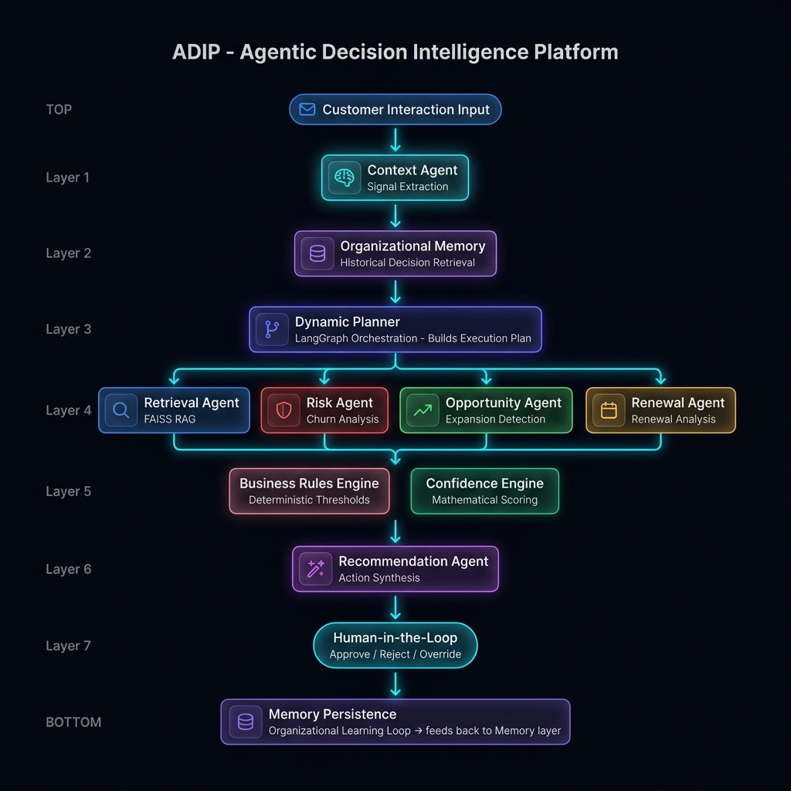

<div align="center">

# ADIP
### Agentic Decision Intelligence Platform

**Enterprise-grade multi-agent AI system that transforms fragmented customer signals into explainable, evidence-backed recommendations — with humans always in control.**

[](https://python.org)
[](https://fastapi.tiangolo.com)
[](https://react.dev)
[](https://langchain-ai.github.io/langgraph/)
[](https://ai.google.dev)
[](https://faiss.ai)

</div>

---

## The Problem

Customer Success Managers handle **hundreds of enterprise accounts** simultaneously. Every interaction — meeting transcripts, CRM updates, emails, support tickets — contains signals buried in unstructured text. Deciding the *next best action* for each customer is:

- **Slow** — manual analysis takes hours
- **Inconsistent** — dependent on individual experience
- **Opaque** — reasoning is undocumented and irreproducible
- **Reactive** — churn is detected after it happens, not before

## The Solution

ADIP orchestrates a network of specialized AI agents that:

1. **Extract signals** from raw customer text (churn risk, renewal intent, dissatisfaction, expansion interest)
2. **Retrieve organizational knowledge** via FAISS RAG from playbooks, CRM notes, meeting history, emails, and support tickets
3. **Plan dynamically** — the Planner only activates agents relevant to the detected signals
4. **Apply deterministic rules** — business logic is never hallucinated
5. **Score confidence mathematically** — 4-factor formula, not LLM-generated probability
6. **Generate ranked, evidence-backed recommendations** with full reasoning
7. **Require human approval** — Approve, Reject, or Override with custom action
8. **Persist decisions as organizational memory** — the platform learns from every human decision

---

## Architecture



```
Customer Interaction Text (transcript, email, CRM note, support ticket)
        │
        ▼
┌─────────────────────┐
│   Context Agent     │  Signal Extraction — detects churn_risk, renewal_risk,
│                     │  upsell_opportunity, low_adoption, champion_resigned etc.
└────────┬────────────┘
         │
         ▼
┌─────────────────────┐
│  Organizational     │  Historical decision retrieval — what did CSMs
│  Memory Service     │  decide last time for this customer?
└────────┬────────────┘
         │
         ▼
┌─────────────────────┐
│  Dynamic Planner    │  LangGraph Orchestration — LLM analyzes signals,
│                     │  builds an ExecutionPlan, selects only relevant agents
└────────┬────────────┘
         │
    ┌────┴────────────────────────┐
    │                             │
    ▼                             ▼
┌──────────┐  ┌──────────┐  ┌──────────┐  ┌──────────┐
│Retrieval │  │  Risk    │  │Opportun- │  │ Renewal  │
│  Agent   │  │  Agent   │  │ity Agent │  │  Agent   │
│ FAISS RAG│  │  Churn   │  │ Upsell   │  │ Renewal  │
└────┬─────┘  └────┬─────┘  └────┬─────┘  └────┬─────┘
     └──────────────┴─────────────┴─────────────┘
                          │
         ┌────────────────┼──────────────────┐
         ▼                                   ▼
┌──────────────────┐              ┌─────────────────────┐
│ Business Rules   │              │  Confidence Engine  │
│ Engine           │              │  (deterministic,    │
│ (deterministic)  │              │   math-based score) │
└────────┬─────────┘              └──────────┬──────────┘
         └──────────────┬───────────────────┘
                        ▼
              ┌─────────────────────┐
              │ Recommendation      │
              │ Agent (synthesis)   │
              └──────────┬──────────┘
                         ▼
              ┌─────────────────────┐
              │  Human-in-the-Loop  │  Approve / Reject / Override
              │  Approval Workflow  │
              └──────────┬──────────┘
                         ▼
              ┌─────────────────────┐
              │  Memory Persistence │  Organizational learning — every decision
              │                     │  improves future recommendations
              └─────────────────────┘
```

---

## Key Design Principles

| Principle | Implementation |
|---|---|
| **No business logic in API routes** | Routes only marshal data; all logic in agents/engine |
| **Agents never call each other** | All communication via `ADIPState` shared state object |
| **Confidence scores are deterministic** | 4-factor math formula — never from LLM |
| **Every recommendation has evidence** | Grounded in FAISS-retrieved enterprise documents |
| **Memory influences future decisions** | Human decisions are indexed and fed into future prompts |
| **Dynamic agent selection** | Planner activates only the agents relevant to detected signals |

---

## Tech Stack

| Layer | Technology |
|---|---|
| **Orchestration** | LangGraph (DAG-based multi-agent pipeline) |
| **AI Model** | Google Gemini (via `google-generativeai`) |
| **Embeddings** | `sentence-transformers` (all-MiniLM-L6-v2) |
| **Vector Store** | FAISS (163 chunks from 31 enterprise documents) |
| **Backend** | FastAPI + SQLAlchemy + SQLite |
| **Frontend** | React 19 + TypeScript + Vite |
| **State Management** | TanStack Query |

---

## Quick Start

### Prerequisites
- Python 3.11+
- Node.js 18+
- Google Gemini API Key ([get one free](https://aistudio.google.com/app/apikey))

### 1 — Clone & Configure

```bash
git clone https://github.com/Yashhh008/Agentic-Decision-Intelligence-Platform
cd Agentic-Decision-Intelligence-Platform
```

Create `.env` in the project root:
```env
GEMINI_API_KEY=your_gemini_api_key_here
```

### 2 — Backend Setup

```powershell
# Create virtual environment
python -m venv .venv
.venv\Scripts\activate

# Install dependencies
pip install -r backend/requirements.txt

# Seed customer database
python -m backend.scripts.seed_customers

# Build FAISS knowledge index (163 chunks from 31 enterprise documents)
python -m backend.scripts.ingest_knowledge

# Start backend
uvicorn backend.main:app --reload --port 8000
```

Verify: http://localhost:8000/docs

### 3 — Frontend Setup

```bash
cd frontend
npm install
npm run dev
```

Open: http://localhost:5173

---

## Demo Scenarios

The platform ships with 4 pre-built enterprise customer personas from the fictional company **NimbusCRM**:

| Customer | Health | Signals | Key Story |
|---|---|---|---|
| **Acme Corp** | 🔴 32 | `churn_risk` · `low_adoption` · `renewal_risk` | 8/25 users active, 2 open critical tickets, renewal in 20 days — imminent churn |
| **TechFlow Inc** | 🟢 87 | `upsell_opportunity` · `expansion_interest` | Expanding to APAC, 142/150 seats used, wants Enterprise plan |
| **Buildify** | 🟡 55 | `onboarding_friction` · `low_adoption` | New customer, confused about features, needs training |
| **NovaSoft** | 🟡 61 | `champion_resigned` · `renewal_risk` | Champion resigned, new IT Director unfamiliar with platform, renewal in 30 days |

### Recommended Demo Flow (10 min)

1. Open **Dashboard** — show portfolio health overview
2. Select **Acme Corp** — customer is critical
3. Paste meeting transcript: *"We're struggling with onboarding, adoption is very low. Our operations team went back to spreadsheets. We have two open support tickets for weeks. We're unsure whether we'll renew."*
4. Click **Run AI Analysis** — watch the Agent Execution Pipeline animate
5. Point out **Planner Panel** — which agents ran and why (dynamic orchestration)
6. Show **Retrieved Knowledge** — RAG evidence from playbooks, CRM notes, email threads
7. Review **Recommendations** — ranked with confidence %, business rule badge, evidence sources
8. **Approve** a recommendation — memory is updated
9. **Run analysis again** — show that memory influences new recommendations (learning loop)

---

## Project Structure

```
backend/
├── agents/           # All AI agents (ContextAgent, RiskAgent, etc.)
├── api/routes/       # FastAPI REST endpoints (8 route modules)
├── config/           # Settings via pydantic-settings
├── core/             # ADIPState (shared state), AgentRegistry
├── engine/           # Planner, ExecutionEngine, ConfidenceEngine, BusinessRulesEngine
├── graph/            # LangGraph orchestration (adip_graph.py)
├── knowledge/        # 31 enterprise markdown documents (CRM, emails, playbooks, etc.)
├── memory/           # SQLAlchemy ORM models
├── prompts/          # LLM prompt templates for each agent
├── scripts/          # seed_customers.py, ingest_knowledge.py
├── services/         # GeminiService, EmbeddingService, RetrievalService, MemoryService
├── vectorstore/      # FAISSVectorStore (163-chunk index)
└── main.py           # FastAPI entry point

frontend/
├── src/
│   ├── api/client.ts     # Axios API client
│   ├── types/index.ts    # TypeScript type definitions
│   └── App.tsx           # Full dashboard (1,200+ lines)
└── vite.config.ts
```

---

## API Reference

| Endpoint | Method | Description |
|---|---|---|
| `/api/v1/customers` | GET | List all customers with health data |
| `/api/v1/sessions` | POST | Create analysis session |
| `/api/v1/sessions/{id}/analyze` | POST | Trigger full agent pipeline |
| `/api/v1/sessions/{id}/planner` | GET | Get planner decision & agent selection |
| `/api/v1/sessions/{id}/recommendations` | GET | Get ranked recommendations |
| `/api/v1/sessions/{id}/knowledge` | GET | Get retrieved RAG evidence chunks |
| `/api/v1/recommendations/{id}` | PATCH | Approve / Reject / Override |
| `/api/v1/customers/{id}/memory` | GET | Get historical decisions for customer |
| `/api/v1/analytics/dashboard` | GET | Platform-wide analytics |

Full interactive docs: http://localhost:8000/docs

---

## Why This Is Different from ChatGPT

| ADIP | ChatGPT |
|---|---|
| Multi-agent orchestration | Single model, single prompt |
| Retrieves from enterprise knowledge base | Relies on training data only |
| Deterministic business rules | No rules — all probabilistic |
| Mathematical confidence scoring | No confidence explanation |
| Persistent organizational memory | No memory across sessions |
| Human-in-the-loop approval workflow | No approval mechanism |
| Reusable platform architecture | Single-purpose chatbot |

---

## Hackathon Notes

- **Built for:** [Hackathon Name]
- **Team:** Yash
- **Architecture Philosophy:** Build vertically — always have a working product, never build layers in isolation
- **Model:** Google Gemini (flash) via `google-generativeai`
- **Local only** — no cloud deployment required to run the full demo
